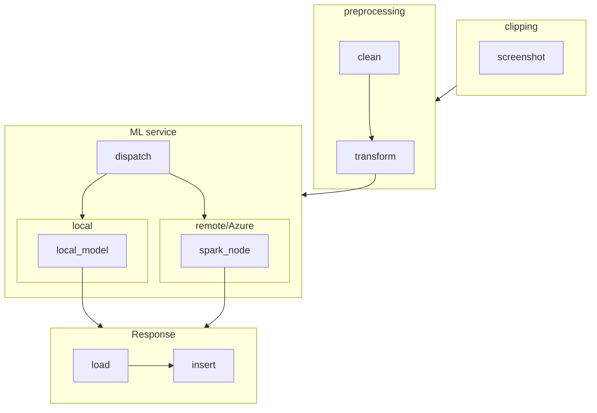

# imtex
 Turns a screen clipping into copyable text using image to text machine learning model built using scala.
 

 Basic pipeline



Build Pipeline

```mermaid
flowchart LR;
dist
gui
ml
clip
src/
resources/
app


Dependencies

spark
cask
swing

TODO:
Implement screen clipping
Implement preprocessing
ML


for dumping data to clipboard
val clipboard = java.awt.Toolkit.getDefaultToolkit.getSystemClipboard
val sel = new java.awt.datatransfer.StringSelection("test")
clipboard.setContents(sel, sel)